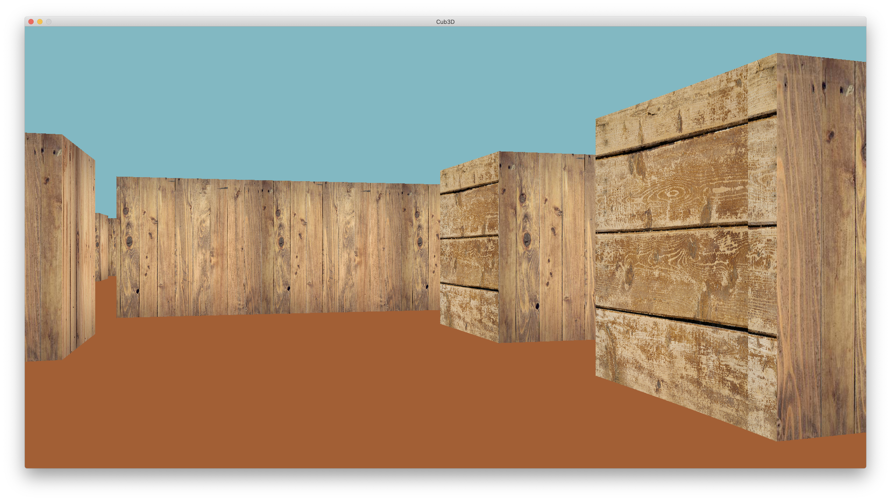
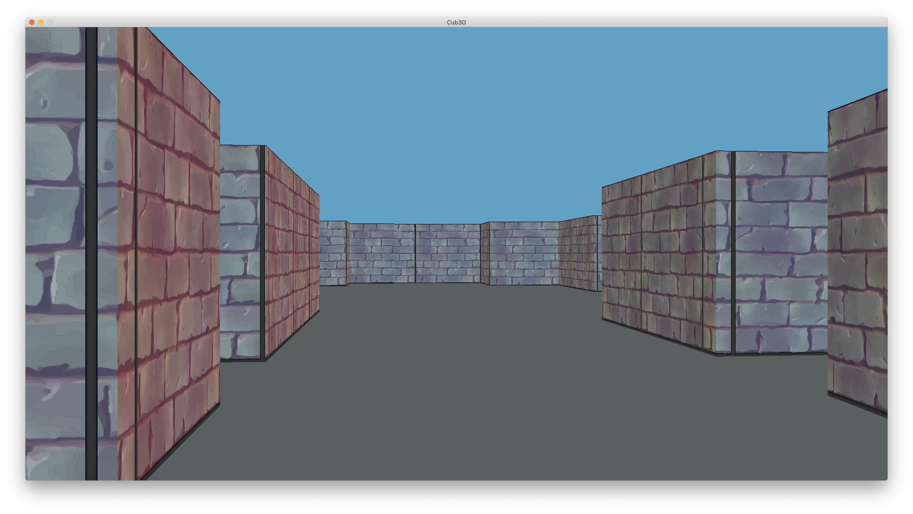

# Cub3D

A simple 3D raycasting game inspired by Wolfenstein 3D, built with MLX42 and libft, featuring map parsing, texture rendering, and basic player movement.

## Build

- Dependencies: MLX42, libft
- Build with make:

```sh
make
make clean
make fclean
make re
```

## Run

Use one of the sample maps in `maps`:

```sh
./cub3d maps/map.cub
```

Example maps:
- `maps/map.cub`
- `maps/map1.cub`
- `maps/map_day.cub`
- `maps/map_night.cub`

## Controls

- Move: W / A / S / D
- Rotate: Left / Right arrows
- Exit: Esc

## Features

- Map parsing from `.cub` files
- Wall and floor/ceiling rendering
- Textured walls using assets in `textures`
- Basic collision detection
- Multiple map configurations

## Configuration

Textures are loaded from `textures`, e.g.:
- North: `textures/wall_n.png`
- South: `textures/wall_s.png`
- East: `textures/wall_e.png`
- West: `textures/wall_w.png`

Core headers:
- `include/cub3d.h`

Entry point:
- `src/main.c`

## Game Environment (Screenshots)




## Libs

- Libft sources: `lib/libft`
- MLX42: `lib/MLX42`

## Notes

- Ensure MLX42 is correctly installed and linked in `Makefile`.
- Maps must follow the expected `.cub` format used by the parser in `src/parsing`.